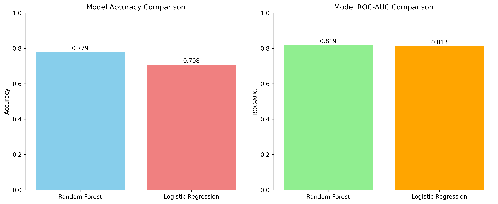
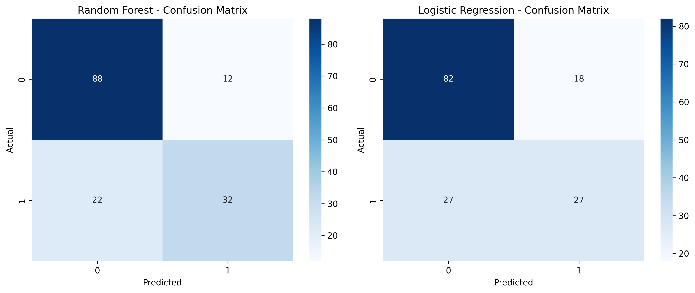

# 🩺 Diabetes Prediction Model

A comprehensive machine learning project that predicts diabetes using the Pima Indians Diabetes dataset. This project implements and compares multiple classification algorithms to identify the best performing model for diabetes prediction.


## 📋 Table of Contents

- [Project Overview](#-project-overview)
- [Dataset Information](#-dataset-information)
- [Project Structure](#-project-structure)
- [Installation & Setup](#-installation--setup)
- [Usage](#-usage)
- [Model Performance](#-model-performance)
- [Results & Visualizations](#-results--visualizations)
- [Key Features](#-key-features)
- [Future Improvements](#-future-improvements)
- [Contributing](#-contributing)
- [License](#-license)

## 🎯 Project Overview

This project implements a complete machine learning pipeline to predict diabetes using patient health metrics. The system:

- **Processes** the Pima Indians Diabetes dataset
- **Trains** multiple machine learning models (Random Forest & Logistic Regression)
- **Evaluates** model performance using various metrics
- **Generates** comprehensive visualizations and reports
- **Saves** trained models for future deployment

**Author:** TNT  
**Version:** 1.0  
**Date:** August 5, 2025

## 📊 Dataset Information

- **Source:** `data/diabetes.csv`
- **Total Samples:** 768 patients
- **Features:** 8 health-related attributes
- **Target:** Binary classification (0 = No Diabetes, 1 = Diabetes)
- **Class Distribution:** 
  - No Diabetes: 500 patients (65.1%)
  - Diabetes: 268 patients (34.9%)

### 🔍 Features Description

| Feature | Description | Unit |
|---------|-------------|------|
| **Pregnancies** | Number of times pregnant | Count |
| **Glucose** | Plasma glucose concentration | mg/dL |
| **BloodPressure** | Diastolic blood pressure | mm Hg |
| **SkinThickness** | Triceps skin fold thickness | mm |
| **Insulin** | 2-Hour serum insulin | mu U/ml |
| **BMI** | Body mass index | kg/m² |
| **DiabetesPedigreeFunction** | Diabetes pedigree function | Score |
| **Age** | Age | Years |

## 📁 Project Structure

```
DataScience/
├── 📄 README.md                           # Project documentation
├── 📄 requirements.txt                    # Python dependencies
├── 📄 LICENSE                            # Project license
├── 📄 1.0-TNT-diabetes-prediction-summary.md  # Detailed project summary
├── 📁 data/
│   └── 📊 diabetes.csv                   # Dataset
├── 📁 scripts/
│   └── 🐍 1.0-TNT-diabetes-prediction.py # Main training script
├── 📁 notebooks/
│   └── 📓 1.0-TNT-exploratory-data-analysis.ipynb  # EDA notebook
├── 📁 output/                            # Trained models
│   ├── 🤖 1.0-TNT-random_forest_model_20250805_205151.pkl
│   ├── 🤖 1.0-TNT-logistic_regression_model_20250805_205151.pkl
│   └── ⚙️ 1.0-TNT-scaler_20250805_205151.pkl
└── 📁 results/                           # Results and visualizations
    ├── 📊 1.0-TNT-model_comparison_20250805_205151.png
    ├── 📊 1.0-TNT-confusion_matrices_20250805_205151.png
    └── 📄 1.0-TNT-model_results_20250805_205151.txt
```

## 🚀 Installation & Setup

### Prerequisites

- Python 3.8 or higher
- pip package manager

### Installation Steps

1. **Clone the repository:**
   ```bash
   git clone https://github.com/NIYITANGA/DataScience.git
   cd DataScience
   ```

2. **Install required packages:**
   ```bash
   pip install pandas numpy scikit-learn matplotlib seaborn joblib
   ```

3. **Verify installation:**
   ```bash
   python -c "import pandas, sklearn, matplotlib; print('All packages installed successfully!')"
   ```

## 💻 Usage

### Training the Models

Run the main training script to train both models and generate results:

```bash
python scripts/1.0-TNT-diabetes-prediction.py
```

This will:
- Load and preprocess the dataset
- Train Random Forest and Logistic Regression models
- Generate performance metrics and visualizations
- Save trained models and results with timestamps

### Using Trained Models for Prediction

```python
import joblib
import pandas as pd
import numpy as np

# Load the best performing model and scaler
model = joblib.load('output/1.0-TNT-random_forest_model_20250805_205151.pkl')
scaler = joblib.load('output/1.0-TNT-scaler_20250805_205151.pkl')

# Example patient data
patient_data = np.array([[6, 148, 72, 35, 0, 33.6, 0.627, 50]])

# Make prediction
prediction = model.predict(patient_data)
probability = model.predict_proba(patient_data)

print(f"Prediction: {'Diabetes' if prediction[0] == 1 else 'No Diabetes'}")
print(f"Probability of Diabetes: {probability[0][1]:.3f}")
```

### Exploratory Data Analysis

Explore the dataset using the provided Jupyter notebook:

```bash
jupyter notebook notebooks/1.0-TNT-exploratory-data-analysis.ipynb
```

## 📈 Model Performance

### 🏆 Best Model: Random Forest Classifier

| Metric | Random Forest | Logistic Regression |
|--------|---------------|-------------------|
| **Accuracy** | **77.92%** | 70.78% |
| **ROC-AUC** | **0.8192** | 0.8130 |
| **Precision (No Diabetes)** | **80%** | 75% |
| **Recall (No Diabetes)** | **88%** | 82% |
| **Precision (Diabetes)** | **73%** | 60% |
| **Recall (Diabetes)** | **59%** | 50% |

### 🔍 Key Performance Insights

- **Random Forest** outperformed Logistic Regression across all metrics
- Both models show good discriminative ability with ROC-AUC > 0.8
- The models handle class imbalance reasonably well
- Random Forest's ensemble approach captures complex feature interactions better

## 📊 Results & Visualizations

### Model Comparison Chart


*Comparison of accuracy and ROC-AUC scores between Random Forest and Logistic Regression models.*

### Confusion Matrices


*Confusion matrices showing the classification performance of both models on the test set.*

### Detailed Results

Complete performance metrics and classification reports are available in:
- 📄 `results/1.0-TNT-model_results_20250805_205151.txt`

## ✨ Key Features

### 🔧 Data Preprocessing
- **Missing Value Handling:** Intelligent replacement of zero values with median values
- **Feature Scaling:** StandardScaler applied for Logistic Regression
- **Stratified Splitting:** Maintains class distribution in train/test splits

### 🤖 Machine Learning Pipeline
- **Multiple Models:** Random Forest and Logistic Regression comparison
- **Cross-Validation Ready:** Structured for easy k-fold implementation
- **Reproducible Results:** Fixed random seeds for consistent outcomes

### 📊 Comprehensive Evaluation
- **Multiple Metrics:** Accuracy, Precision, Recall, ROC-AUC
- **Visual Analysis:** Confusion matrices and performance comparisons
- **Detailed Reports:** Text-based results with timestamps

### 💾 Model Persistence
- **Serialized Models:** Trained models saved as pickle files
- **Preprocessing Pipeline:** Scaler saved for consistent preprocessing
- **Timestamped Outputs:** Organized results with unique identifiers

## 🚀 Future Improvements

### 🎯 Model Enhancement
- [ ] **Hyperparameter Tuning:** Implement GridSearchCV/RandomizedSearchCV
- [ ] **Advanced Models:** XGBoost, SVM, Neural Networks
- [ ] **Ensemble Methods:** Voting classifiers, stacking
- [ ] **Feature Engineering:** Polynomial features, interaction terms

### 📊 Data & Evaluation
- [ ] **Cross-Validation:** K-fold cross-validation implementation
- [ ] **Class Imbalance:** SMOTE, ADASYN, or other resampling techniques
- [ ] **Feature Selection:** RFE, SelectKBest, feature importance analysis
- [ ] **Additional Metrics:** F1-score, Matthews correlation coefficient

### 🔧 Technical Improvements
- [ ] **Configuration Management:** YAML/JSON config files
- [ ] **Logging System:** Structured logging with different levels
- [ ] **Unit Tests:** Comprehensive test suite
- [ ] **CI/CD Pipeline:** Automated testing and deployment

### 🌐 Deployment
- [ ] **Web Interface:** Flask/FastAPI web application
- [ ] **REST API:** Model serving via API endpoints
- [ ] **Docker Container:** Containerized deployment
- [ ] **Cloud Deployment:** AWS/GCP/Azure integration

## 🤝 Contributing

Contributions are welcome! Please feel free to submit a Pull Request. For major changes, please open an issue first to discuss what you would like to change.

### Development Setup

1. Fork the repository
2. Create a feature branch (`git checkout -b feature/AmazingFeature`)
3. Commit your changes (`git commit -m 'Add some AmazingFeature'`)
4. Push to the branch (`git push origin feature/AmazingFeature`)
5. Open a Pull Request

## 📄 License

This project is licensed under the MIT License - see the [LICENSE](LICENSE) file for details.

## 📞 Contact

**TNT** - Project Author

- GitHub: [@NIYITANGA](https://github.com/NIYITANGA)
- Project Link: [https://github.com/NIYITANGA/DataScience](https://github.com/NIYITANGA/DataScience)

---

⭐ **If you found this project helpful, please give it a star!** ⭐

---

*Last updated: August 5, 2025*
